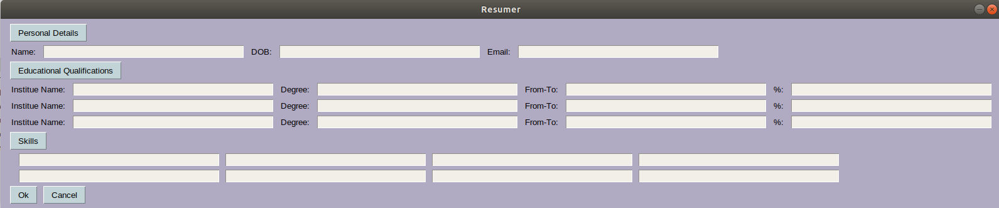
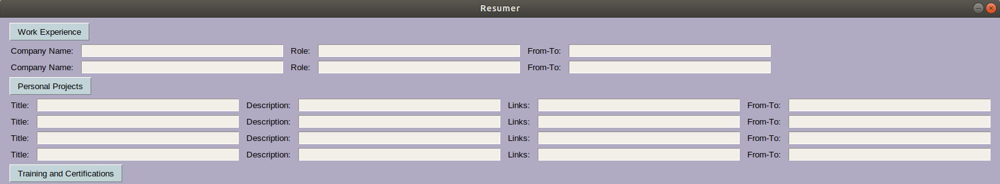
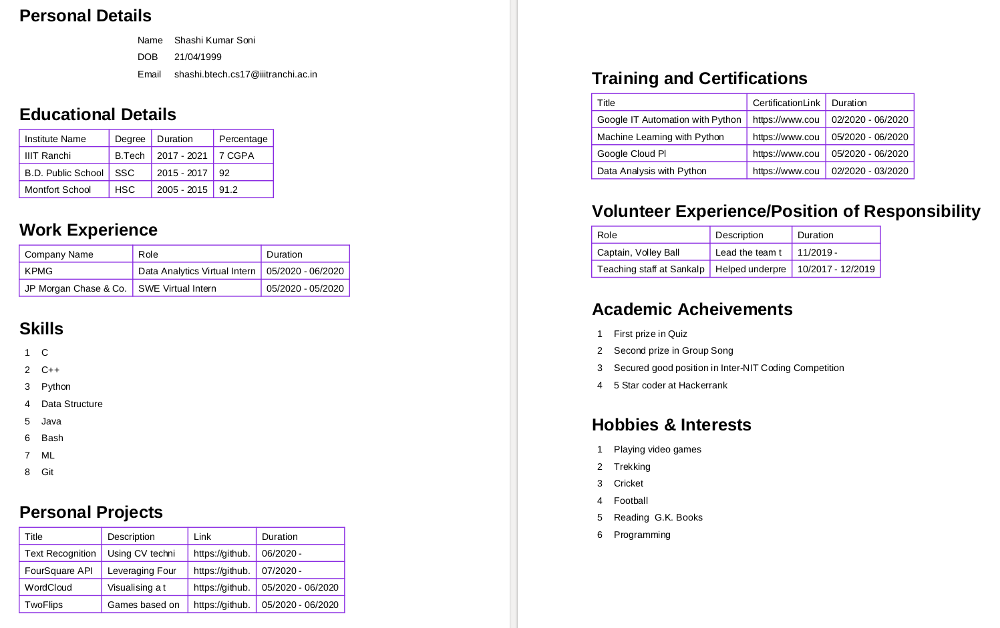

# Resume Generator

Using GUI to take the input from the user and then passing it to the resume generator script to produce the resume.

## Visual Representation

    

#### <code>Entering the details in this produces this PDF </code>

### Steps to run:
<ul>
<li><code>cd</code> into the cloned folder
<li>Run the following code in the terminal: <code>bash run.sh</code></li>
</ul>

### Enter the details, sitback and relax
<ul><li>Resume will be available in the scripts folder</li></ul>